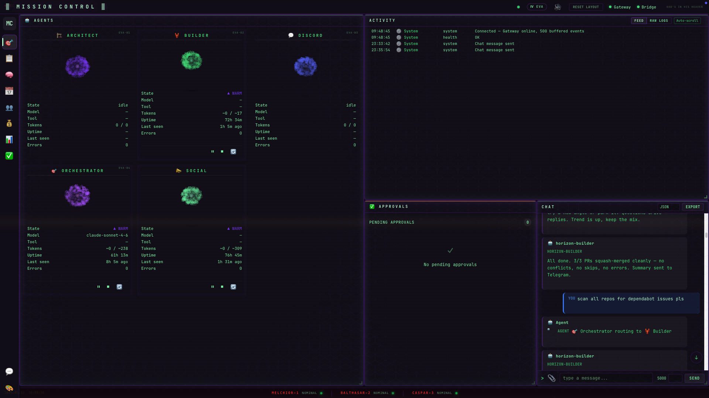

# Mission Control

> A self-hosted, EVA-themed dashboard for running swarms of LLM agents — with pluggable model providers, pluggable outbound channels, and your keys staying on your machine.




## What is this?

Mission Control is a small, opinionated control room for **a team of LLM agents you define yourself**. Each agent has a name, an emoji, a system prompt, a preferred model, and (optionally) outbound channels it can post to. You talk to them from a browser dashboard that runs entirely on your laptop — no cloud, no telemetry, no account required.

It's designed for one operator running a handful of agents, not a multi-tenant SaaS. Think "personal Mission Control for an AI swarm" rather than "agent platform."

### What ships in the box

- **2 starter agents** — `assistant` (general-purpose) and `researcher` (web-search focused). Edit the YAML to make them yours, or drop in new files.
- **5 model providers** — Anthropic (Claude), OpenAI (GPT), Google Gemini, OpenRouter, and local Ollama. Each is a single-file Python adapter you can copy and modify.
- **2 outbound integrations** — Discord and Telegram. Agents can post into channels or DMs you wire them to.
- **2 dispatch runtimes** — connect to a running OpenClaw gateway, or run model SDKs directly. Pick per agent.
- **EVA-themed UI** — vanilla JS, no framework lock-in, no build step. Open the browser, talk to agents, see streaming output.
- **Single-script setup** — `./setup.sh` installs Python deps, generates secrets, scaffolds config, then walks you through an interactive credentials wizard (validates every key with a live ping). `./mission-control.sh` launches it.

### Who this is for

- Devs who want to run an agent swarm locally without signing up for an "AI platform."
- Anyone who already has Anthropic/OpenAI **OAuth** accounts (Claude Pro/Team, ChatGPT) and would rather route through them than buy a separate API-key plan.
- People who want full control over agent prompts, model choices, and where each agent is allowed to post.

### Who this is *not* for (yet)

- Production multi-user deployments. This runs on `127.0.0.1` by design.
- Headless server use cases — there is a UI assumption baked in.
- Anyone needing strict audit logs, RBAC, or org-scale secret management out of the box.

## Two ways to power your agents

You pick **per agent** how it talks to the model. Both can coexist in the same install.

### Path A — OpenClaw gateway (recommended)

[OpenClaw](https://github.com/openclaw/openclaw) is a separate, locally-run gateway that holds your model connections in one place. Mission Control connects to it over a WebSocket (`ws://127.0.0.1:18789` by default).

**Why this is the recommended path:**

- **OAuth-friendly.** Connect Anthropic via your Claude Pro/Team subscription, OpenAI via your ChatGPT account, etc. — no API keys needed in this repo's `.env`.
- **One auth surface.** Add a model account once in OpenClaw, every agent that targets it inherits the connection.
- **Streaming + tool use** are handled in the gateway, so this repo stays small.

You set `OPENCLAW_GATEWAY_TOKEN` in `.env` (the bearer token your gateway issues), give an agent `runtime: openclaw` in its YAML, and you're done.

### Path B — Direct SDK (standalone fallback)

If you don't run OpenClaw, each provider can talk directly to the upstream API using a key from `.env`:

```
ANTHROPIC_API_KEY=sk-ant-...
OPENAI_API_KEY=sk-...
GEMINI_API_KEY=...
OPENROUTER_API_KEY=...
OLLAMA_HOST=http://127.0.0.1:11434
```

This is the simplest setup and works fine — but the underlying Python SDKs require an API key at construction time, so **OAuth-only accounts are not supported on this path**. If you only have a Claude Pro subscription (no API key), use Path A.

You can run `assistant` against the gateway and `researcher` directly against OpenAI in the same install — just set each agent's `runtime:` field accordingly.

## Quickstart

Requires Python 3.11+ on macOS or Linux. Windows users: use WSL2.

```bash
git clone <repo-url> mission-control
cd mission-control
./setup.sh
```

`setup.sh` is idempotent. It creates a virtualenv, installs deps, copies `.env.example` → `.env`, generates a per-install `BRIDGE_AUTH_TOKEN`, scaffolds the canvas config, installs `gitleaks` for secret scanning, then walks you through an interactive credentials wizard.

The wizard makes you pick one of:

- **Path A — OpenClaw gateway** *(recommended)* — paste your gateway URL + token. The wizard probes the WebSocket port; bad config is not saved.
- **Path B — Direct SDK** — paste keys for any of Anthropic, OpenAI, Gemini, OpenRouter, or Ollama. Each key is live-validated against the provider's API before it's written to `.env`.
- **Path M — Mixed** — both, for power users.

You can also configure Discord/Telegram tokens (also live-validated) in the same flow. Re-run anytime with `./setup.sh --reconfigure` to skip the mechanical bootstrap and jump straight to the wizard.

Then launch:

```bash
./mission-control.sh
```

Your browser opens to `http://127.0.0.1:8100/` with the EVA-themed dashboard. Click an agent, type a message, watch it stream a response.

For the full walkthrough (including troubleshooting), see **[docs/getting-started.md](docs/getting-started.md)**.

## Configuration cheat sheet

Everything Mission Control reads at runtime lives in two places:

| Where | What |
|---|---|
| `.env` | Secrets and runtime knobs — provider keys, gateway URL/token, bridge port, integration tokens. See `.env.example` for the full list (18 canonical vars). |
| `config/agents/*.yml` | One file per agent. Sets `id`, `display_name`, `emoji`, `model_pref`, `runtime`, `allowed_tools`, and `system_prompt` (inline or `@file:./prompts/foo.md`). |

Common things you'll change:

- **Add or rename an agent** → drop a YAML in `config/agents/`. See [docs/adding-an-agent.md](docs/adding-an-agent.md).
- **Wire an agent to Discord/Telegram** → set `DISCORD_BOT_TOKEN` / `TELEGRAM_BOT_TOKEN` in `.env`, then list channels in the agent's YAML.
- **Switch default models** → `ANTHROPIC_MODEL`, `OPENAI_MODEL`, `GEMINI_MODEL` in `.env` set the per-provider default; agent YAML can override.
- **Run on a different port** → `BRIDGE_PORT` in `.env`.

## Architecture in 30 seconds

Mission Control is built around four small Python `Protocol`s:

- **AgentDefinition** — the YAML loader. Files in `config/agents/` become typed dataclasses.
- **ModelProvider** — sends a prompt, yields tokens. Files in `server/providers/`.
- **Integration** — outbound channel adapter (Discord, Telegram, ...). Directories in `server/integrations/`.
- **RuntimeAdapter** — decides *how* a turn is dispatched: `openclaw.py` (gateway WebSocket) or `local.py` (subprocess SDK).

A FastAPI server (`bridge_server.py`) owns the dashboard, the WebSocket to the browser, and routing turns to the right RuntimeAdapter. The frontend is vanilla JS — no React, no build step, no node_modules.

Full architecture write-up: **[docs/architecture.md](docs/architecture.md)**.

## Extending it

Mission Control is meant to be hacked on. Each adapter type is a single file or directory with a clear Protocol contract.

- [Add an agent](docs/adding-an-agent.md) — YAML schema, prompt files, model preferences
- [Add a model provider](docs/adding-a-model-provider.md) — copy `providers/anthropic.py`, point at any LLM API
- [Add an integration](docs/adding-an-integration.md) — wire agents to Slack, IRC, custom webhooks, anything
- [Architecture reference](docs/architecture.md) — Protocols, dataclasses, runtime flow

## Troubleshooting

| Symptom | Likely fix |
|---|---|
| `mission-control.sh` exits saying `BRIDGE_AUTH_TOKEN missing` | Re-run `./setup.sh` — it generates one and writes it into `.env`. |
| Agent replies with a key/auth error | Path A: check `OPENCLAW_GATEWAY_TOKEN` matches your gateway. Path B: confirm the relevant `*_API_KEY` is set. |
| Browser opens but the dashboard is blank | Hard-refresh (the EVA theme has cached assets); confirm `http://127.0.0.1:8100/dashboard/` returns HTML. |
| Discord/Telegram bot doesn't post | Confirm the bot is invited to the channel and the channel ID in the agent YAML matches. |
| `gitleaks` flags your `.env` | That's expected — `.env` is in `.gitignore`. Don't commit it. |

More in [docs/getting-started.md § Troubleshooting](docs/getting-started.md).

## Status

**Alpha.** APIs, the YAML schema, and `.env` variable names may change between minor versions. The included starter agents and providers are exercised on the dev machine but you should vet the adapter code paths for your own stack before relying on them.

For local-only single-operator use, this is what it's designed for. For anything more, treat it as a starting point and harden it: rotate `BRIDGE_AUTH_TOKEN` on a schedule appropriate to your threat model, audit each Integration adapter you enable, and don't expose the bridge port beyond `127.0.0.1` without putting auth in front of it.

## License

[MIT](LICENSE) © 2026 Mission Control Contributors

Use it, fork it, ship it. PRs welcome.
